# Corum 사이트 테스터 가이드

> 이 문서는 Corum 사이트를 처음 접하는 테스터를 위한 안내 가이드입니다.  
> 실제 서비스용 가이드는 추후 별도로 작성됩니다.

---

## 테스트 계정

| 항목 | 값 |
|------|-----|
| 아이디 | `user1` |
| 비밀번호 | `passworduser1` |

---

## 목차

1. [로그인](#1-로그인)
2. [페이지 구성 안내](#2-페이지-구성-안내)
3. [메인 페이지 (대시보드)](#3-메인-페이지-대시보드)
4. [메뉴 구성](#4-메뉴-구성)
   - [안내 페이지](#41-안내-페이지)
   - [캘린더](#42-캘린더)
   - [게시판](#43-게시판)
   - [글쓰기](#44-글쓰기)
5. [알림](#5-알림)
6. [사용자 메뉴 & 테마](#6-사용자-메뉴--테마)
7. [마이페이지](#7-마이페이지)
8. [로그아웃](#8-로그아웃)

---

## 1. 로그인

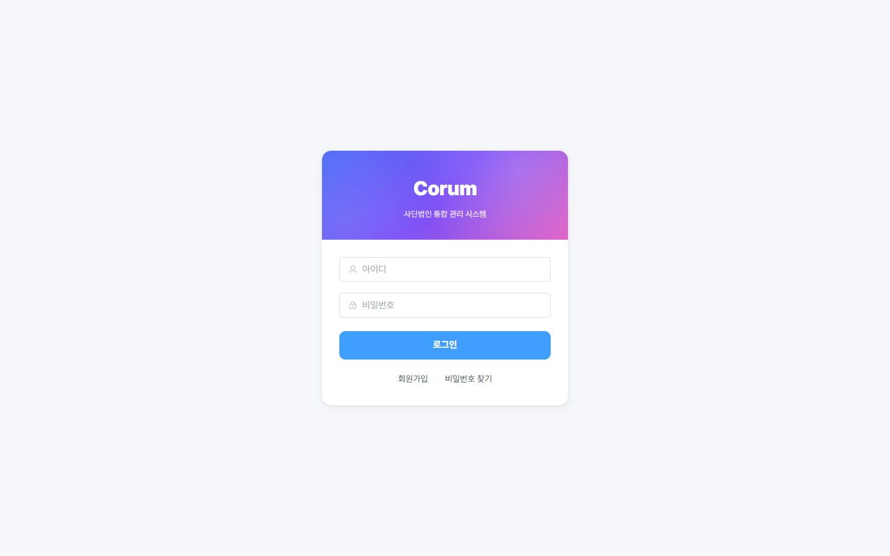

사이트에 접속하면 로그인 페이지가 나타납니다.

- **아이디**와 **비밀번호**를 입력한 뒤 **로그인** 버튼을 클릭합니다.
- 테스트 계정: `user1` / `passworduser1`
- 비밀번호를 잊었을 경우 **비밀번호 찾기**를 통해 이메일로 재설정 링크를 받을 수 있습니다.
- 아직 계정이 없다면 **회원가입** 링크를 눌러 가입할 수 있습니다.

---

## 2. 페이지 구성 안내

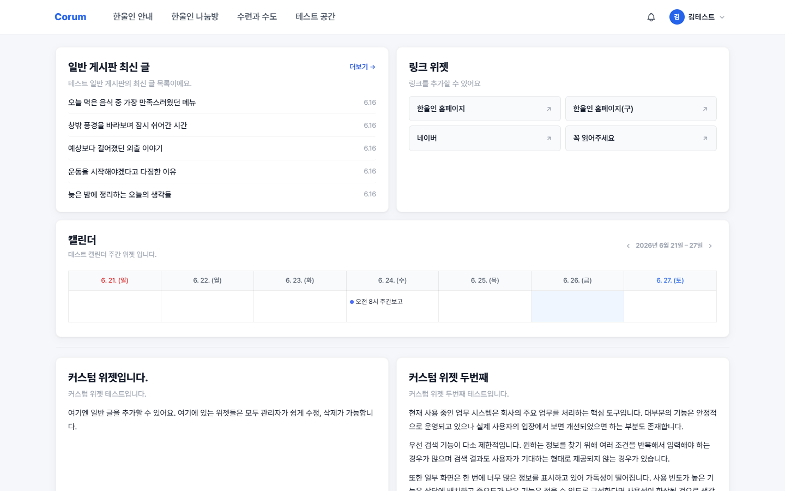

로그인 후 나타나는 기본 화면 구성입니다.

### 상단 헤더

| 영역 | 설명 |
|------|------|
| **로고** (좌측 "Corum") | 클릭 시 메인 페이지(대시보드)로 이동합니다 |
| **상단 메뉴** (로고 우측) | 최상위 메뉴 4개가 표시됩니다. 클릭하면 왼쪽 사이드바에 하위 메뉴 전체가 펼쳐집니다 |
| **알림** (벨 아이콘) | 새로운 알림을 확인합니다 |
| **내 이름** (우측 끝) | 클릭하면 마이페이지·로그아웃 등 사용자 메뉴가 열립니다 |
| **라이트/다크 버튼** | 화면 색상 테마를 전환합니다 |

### 콘텐츠 영역

| 영역 | 설명 |
|------|------|
| **사이드바** (좌측) | 상단 메뉴 클릭 시 해당 그룹의 전체 하위 메뉴가 표시됩니다 |
| **메인 콘텐츠** (중앙) | 선택한 메뉴의 내용(대시보드, 게시판, 캘린더 등)이 표시됩니다 |

### 하단 푸터

이용약관, 개인정보처리방침, 문의하기 링크가 있습니다.

---

## 3. 메인 페이지 (대시보드)

로그인 후 첫 화면은 대시보드입니다. 다양한 위젯이 한눈에 보이도록 구성되어 있습니다.

### 3-1. 상단 위젯 영역

화면 상단에는 다음 위젯이 배치됩니다.

- **이미지 슬라이더** — 자동으로 넘어가는 이미지 배너. 하단의 점(●)을 클릭하거나 좌우 화살표로 직접 이동할 수 있습니다.
- **게시판 최신글** — 지정된 게시판의 최근 게시글 목록. 제목을 클릭하면 해당 글로 이동합니다.

### 3-2. 중간 위젯 영역

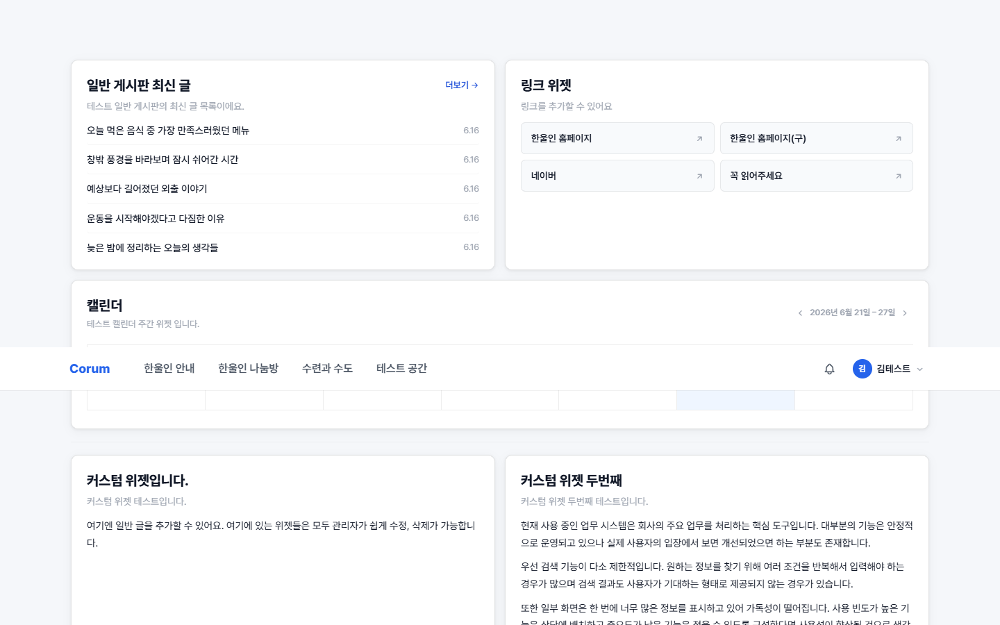

- **갤러리 최신 이미지** — 갤러리 게시판의 최근 이미지가 썸네일 그리드로 표시됩니다.
- **링크 모음** — 자주 사용하는 외부 링크 목록입니다. 클릭 시 새 탭으로 열립니다.

### 3-3. 하단 위젯 영역

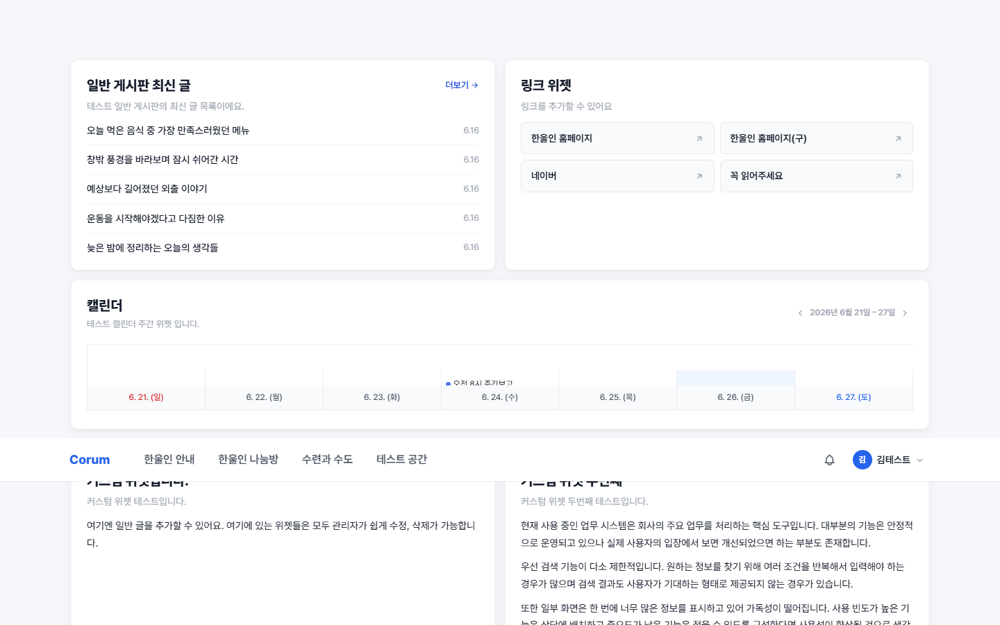

- **캘린더 (주간/월간)** — 등록된 일정을 한눈에 확인할 수 있습니다.
- **추가 게시판 최신글** — 다른 게시판의 최근 게시글이 표시됩니다.

---

## 4. 메뉴 구성

상단의 메뉴 그룹을 클릭하면 좌측 사이드바에 하위 메뉴 전체가 나타납니다.

### 4-1. 안내 페이지

**한울인 안내** 그룹을 클릭한 모습입니다.

- 사이드바에 **한울인이란, 21일 과정, 49일 과정** 등 하위 메뉴가 표시됩니다.
- 현재 선택된 메뉴는 사이드바에서 강조 표시됩니다.

---

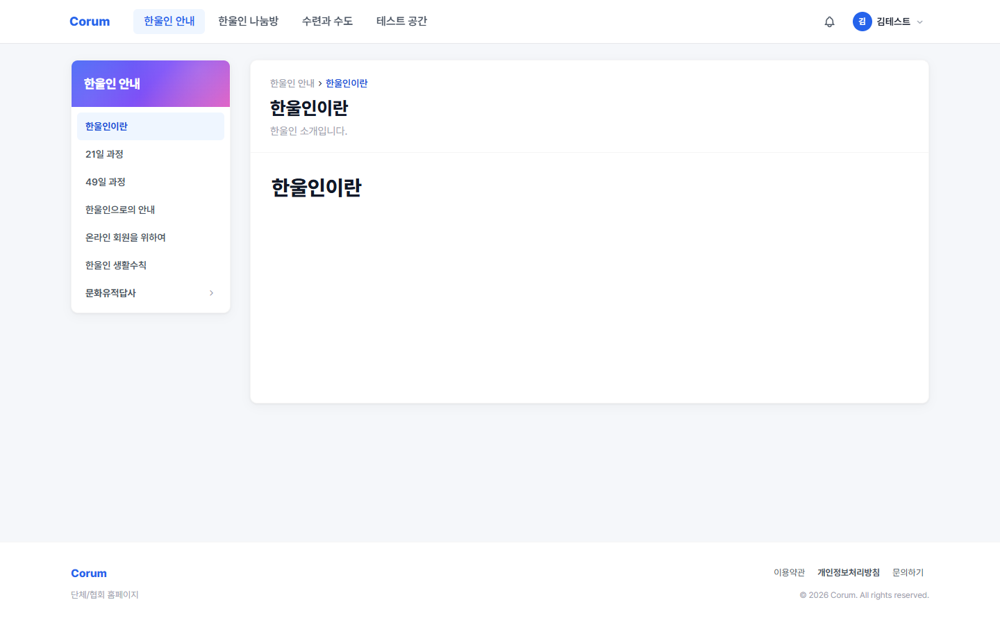

안내 페이지는 텍스트, 이미지 등으로 구성된 정보 페이지입니다.

- 관리자가 직접 편집한 콘텐츠가 표시됩니다.
- 스크롤하여 전체 내용을 확인할 수 있습니다.

---

### 4-2. 캘린더

#### 월간 뷰

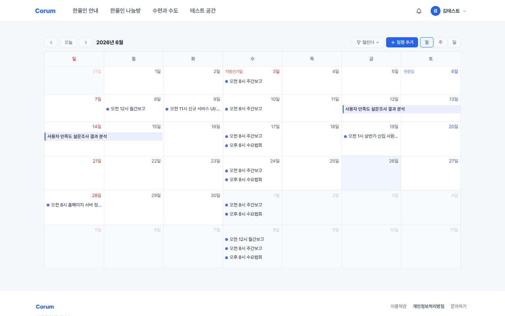

- 한 달의 일정을 한눈에 볼 수 있습니다.
- 일정 항목을 클릭하면 상세 내용을 확인할 수 있습니다.
- 좌우 화살표로 이전/다음 달로 이동합니다.
- 상단 **오늘** 버튼으로 현재 월로 돌아옵니다.

#### 주간 뷰

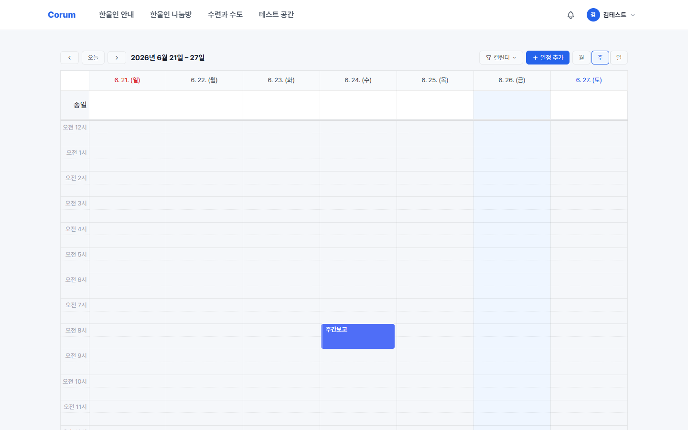

- 우측 상단의 **주** 버튼을 클릭하면 주간 시간표 형태로 전환됩니다.
- 시간대별로 일정이 배치되어 하루 일정을 상세하게 확인할 수 있습니다.
- **월** 버튼으로 다시 월간 뷰로 돌아올 수 있습니다.

---

### 4-3. 게시판

#### 일반 게시판

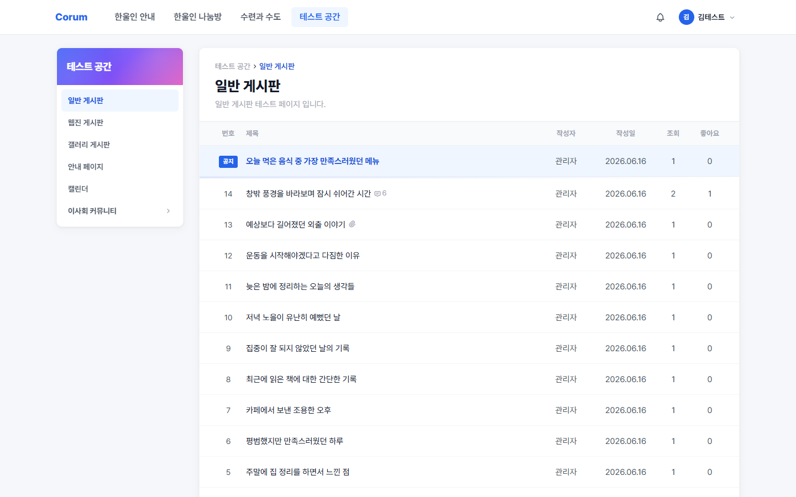

- 게시글 목록이 표 형태로 표시됩니다.
- **번호, 제목, 작성자, 작성일, 조회수** 등 정보를 한눈에 확인할 수 있습니다.
- 상단에 **공지글**이 고정되어 표시됩니다.
- 제목을 클릭하면 게시글 상세 페이지로 이동합니다.
- 우측 상단의 검색창에서 제목/내용/작성자로 검색할 수 있습니다.

#### 웹진 게시판

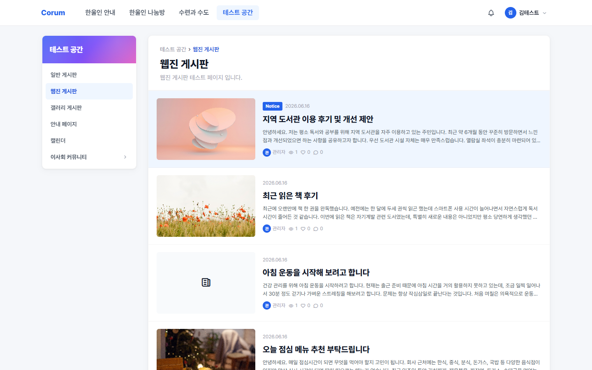

웹진 형식의 콘텐츠 게시판입니다. 카드 형태의 레이아웃으로 이미지와 요약 내용이 표시됩니다.

#### 갤러리 게시판

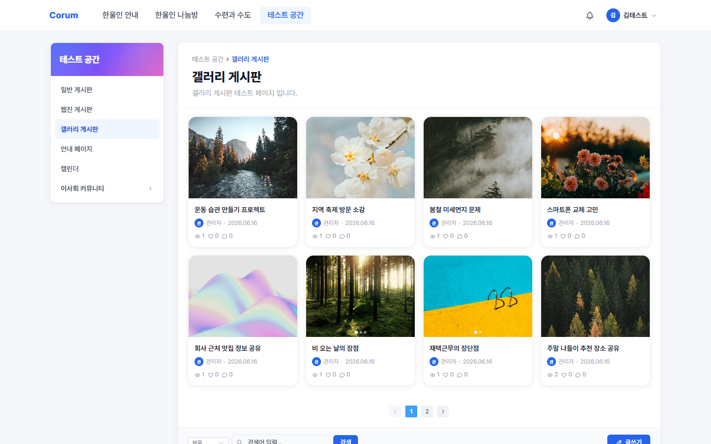

- 이미지 중심의 썸네일 그리드 레이아웃으로 표시됩니다.
- 각 이미지를 클릭하면 해당 게시글 상세 페이지로 이동합니다.

---

#### 게시글 상세

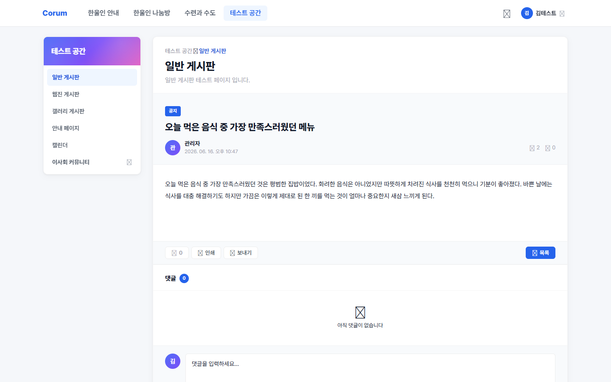

- 게시글 제목, 작성자, 작성일, 조회수가 상단에 표시됩니다.
- 본문 내용은 이미지, 표, 링크 등 다양한 형식을 포함할 수 있습니다.

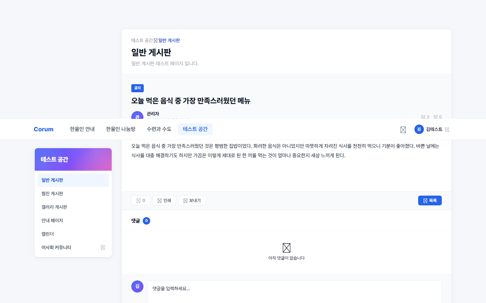

- 본문 하단에 **댓글** 영역이 있습니다.
- 로그인한 사용자는 댓글을 작성할 수 있으며, 댓글에 대댓글도 달 수 있습니다.
- 게시글 하단의 **이전글 / 다음글** 버튼으로 인접 게시물로 이동할 수 있습니다.

---

### 4-4. 글쓰기

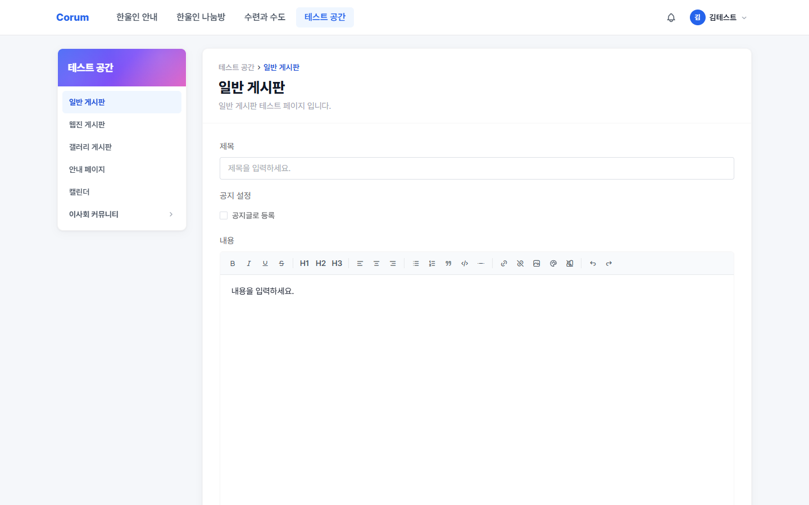

게시판 목록 우측 상단의 **글쓰기** 버튼을 클릭하면 작성 화면이 열립니다.

- **제목**을 입력합니다.
- **본문 편집기**(TipTap 위지윅)에서 텍스트, 이미지, 표 등을 삽입할 수 있습니다.
  - 굵게, 기울임, 밑줄, 취소선
  - 제목(H1~H3), 인용문, 코드 블록
  - 이미지 삽입, 링크 삽입
- **파일 첨부**가 필요한 경우 하단의 첨부 영역을 이용합니다.
- 작성 완료 후 **등록** 버튼을 클릭하면 게시글이 저장됩니다.

---

## 5. 알림

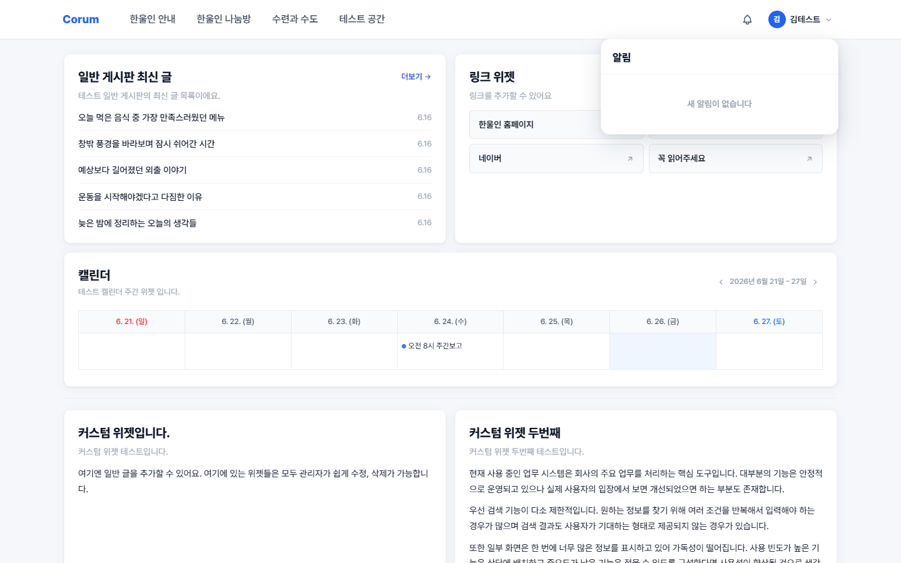

상단 헤더의 **벨(🔔) 아이콘**을 클릭하면 알림 패널이 열립니다.

- 새 댓글, 쪽지, 공지 등 활동 알림이 표시됩니다.
- 각 알림을 클릭하면 해당 페이지로 이동합니다.
- 읽지 않은 알림 수가 벨 아이콘 옆에 숫자로 표시됩니다.

---

## 6. 사용자 메뉴 & 테마

### 사용자 메뉴

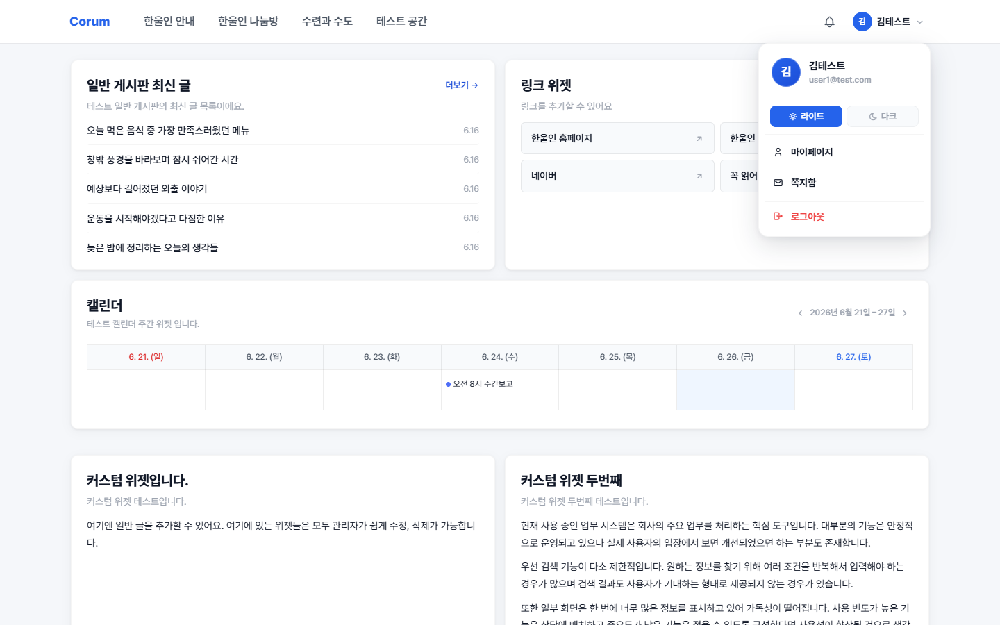

상단 헤더 우측의 **내 이름**을 클릭하면 사용자 메뉴가 열립니다.

| 메뉴 | 기능 |
|------|------|
| **마이페이지** | 내 정보 수정, 비밀번호 변경 등 |
| **쪽지** | 다른 회원과 쪽지 주고받기 |
| **로그아웃** | 현재 세션 종료 |

### 라이트 / 다크 모드

헤더의 **라이트 / 다크** 버튼으로 테마를 즉시 전환할 수 있습니다.

다크 모드로 전환하면 전체 화면이 어두운 색조로 변경됩니다. 눈의 피로를 줄이고 싶을 때 활용하세요.

---

## 7. 마이페이지

### 내 정보

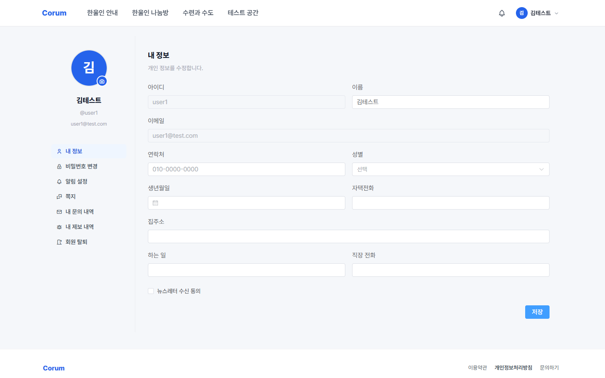

사용자 메뉴에서 **마이페이지**를 클릭하면 개인 정보 페이지로 이동합니다.

- **좌측 프로필 카드**: 프로필 사진, 이름, 아이디, 이메일, 소속 그룹이 표시됩니다.
  - 카메라 아이콘을 클릭하면 프로필 사진을 변경할 수 있습니다.
- **내 정보 탭**: 이름, 연락처, 생년월일, 주소 등 개인 정보를 수정할 수 있습니다.
- 좌측 메뉴에서 **쪽지함, 문의 내역, 알림 설정, 회원 탈퇴** 등으로 이동할 수 있습니다.

### 비밀번호 변경

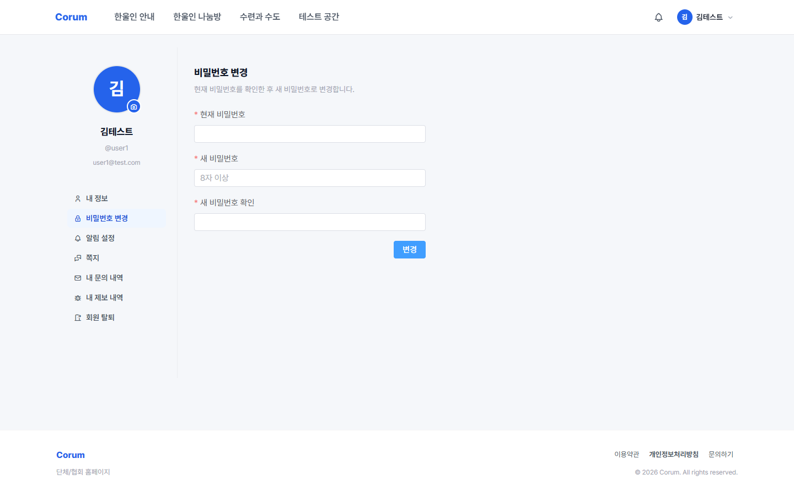

좌측 메뉴에서 **비밀번호 변경**을 선택합니다.

- **현재 비밀번호**를 먼저 입력합니다.
- **새 비밀번호**와 **새 비밀번호 확인**을 입력합니다 (8자 이상).
- **변경** 버튼을 클릭하면 비밀번호가 변경됩니다.

---

## 8. 로그아웃

사용자 메뉴에서 **로그아웃**을 클릭하면 세션이 종료되고 로그인 페이지로 이동합니다.

- 공용 컴퓨터에서 사용한 경우 반드시 로그아웃해주세요.
- 로그아웃 후에는 로그인이 필요한 페이지에 접근할 수 없습니다.

---

## 기타 안내

### 테스트 시 주의사항

- 이 환경은 **테스트용**으로 운영됩니다. 실제 민감한 개인정보는 입력하지 마세요.
- 게시글 작성, 댓글, 캘린더 일정 등록 등 모든 기능을 자유롭게 테스트해보세요.
- 문제가 발생하거나 개선 의견이 있으면 관리자에게 알려주세요.

### 지원 브라우저

Chrome, Edge, Firefox 최신 버전을 권장합니다.

---

*본 가이드는 테스트 버전을 기준으로 작성되었습니다.*
